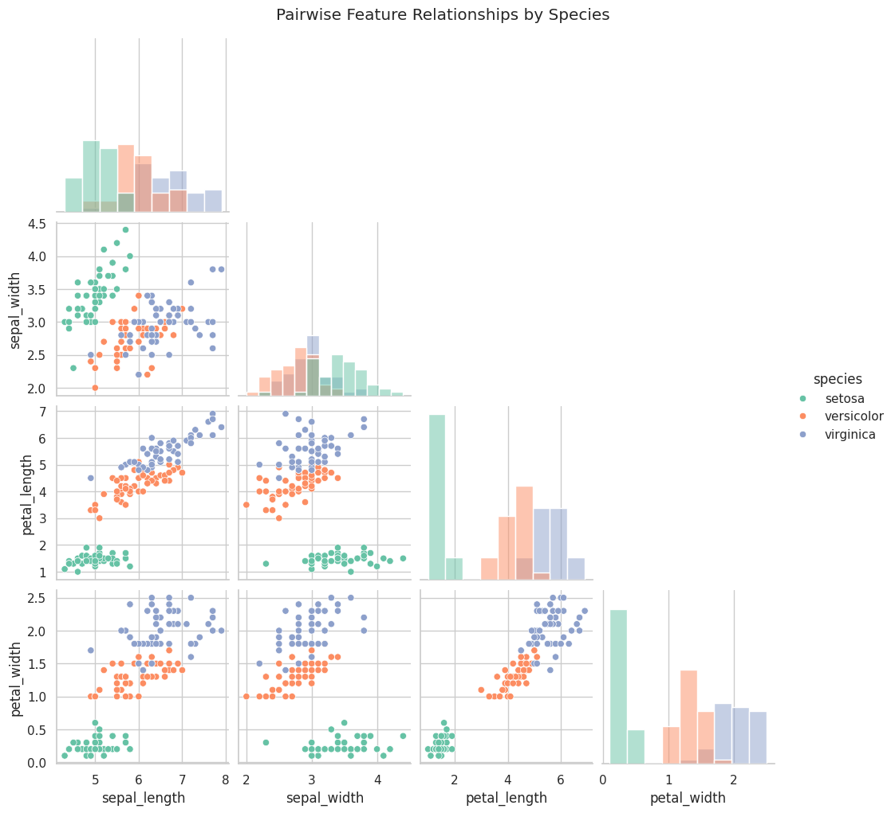
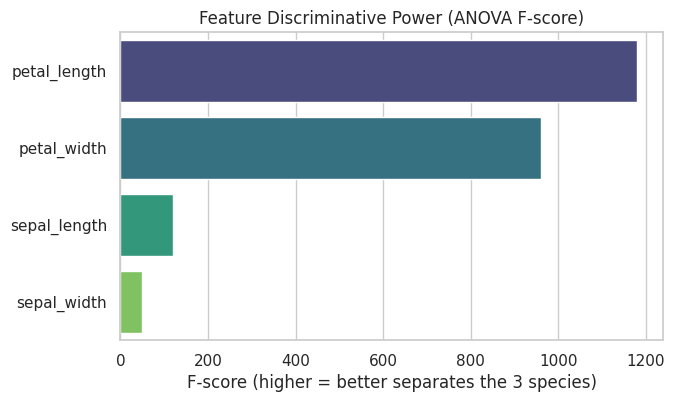
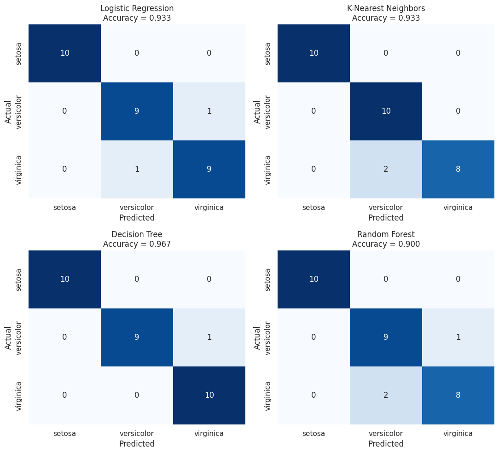
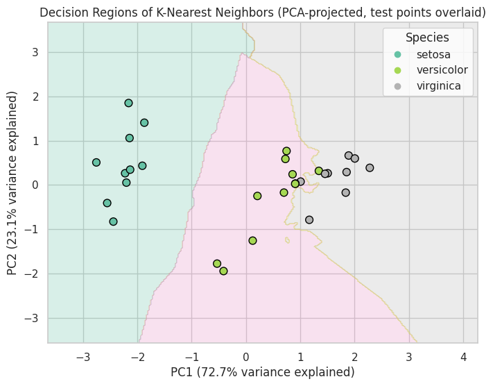
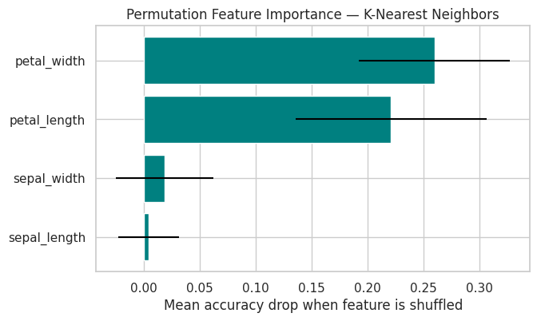

# Task 1 — Iris Flower Species Classification

**Program:** Oasis Infobyte Summer Internship Program (SIP) — Data Science Track  
**Author:** **Youssef Laaroussi** (Master's in Data Science & Artificial Intelligence)  
**Deliverable:** `Iris_Flower_Classification.ipynb` (Google Colab & Jupyter Ready, Pre-executed)

---

## 📌 Executive Summary & Objective

Train and rigorously compare multiple classification models to identify an iris flower's species (*Setosa*, *Versicolor*, *Virginica*) from four physical measurements (sepal length, sepal width, petal length, petal width). The objective is to justify the final model choice using **solid statistical evidence and cross-validation** rather than relying on a single, potentially lucky test split.

---

## 🔬 Skills & Methodological Rigor

- **Statistical feature selection:** ANOVA F-test (`f_classif`) to quantitatively rank feature discriminative power before model training.
- **Hyperparameter tuning via cross-validation:** Grid search over KNN's $k$ and Decision Tree's `max_depth` evaluated with `StratifiedKFold` (5 folds).
- **Comprehensive model comparison:** 4 distinct model families evaluated on both held-out test split and 5-fold CV (Logistic Regression, KNN, Decision Tree, Random Forest).
- **Full metric suite:** Accuracy, Precision, Recall, Macro/Weighted F1-score, ROC-AUC (One-vs-Rest), Cohen's Kappa, and Matthews Correlation Coefficient (MCC).
- **Model interpretability:** Permutation feature importance (robust to collinearity) cross-validated with ANOVA F-rankings.
- **Dimensionality reduction for visualization:** 2D PCA projection with decision boundary visualization.
- **Model persistence:** Production-ready serialized pipeline saved with `joblib`.

---

## 📊 Visual Insights & Key Results

### 1. Exploratory Data Analysis & Feature Separation
Petal length and petal width show distinct clustering for *Iris Setosa*, while *Versicolor* and *Virginica* have a slight natural morphological overlap.



### 2. Statistical Feature Discriminative Power (ANOVA F-Test)
Petal length ($F \approx 1180$) and petal width ($F \approx 960$) are by far the most discriminative dimensions.



### 3. Model Evaluation & Confusion Matrix
Four models were evaluated under identical stratified train/test conditions. K-Nearest Neighbours ($k=3$) achieved **96.7% mean 5-fold CV accuracy** and **93.3% test accuracy**.



### 4. PCA Decision Boundary & Permutation Importance
PCA projection into 2 principal components confirms clear separation, and permutation importance matches the ANOVA ranking.

| PCA Decision Boundary | Permutation Feature Importance |
| :---: | :---: |
|  |  |

---

## 📈 Performance Summary

| Model | Hyperparameters | 5-Fold CV Accuracy (Mean ± Std) | Held-out Test Accuracy | Macro F1-Score | Status |
| :--- | :--- | :---: | :---: | :---: | :--- |
| **K-Nearest Neighbours** | **$k = 3$, Euclidean** | **96.7% ± 3.3%** | **93.3%** | **0.933** | 🏆 **Selected Best Model** |
| Random Forest | $n = 100$, max_depth=None | 95.0% ± 3.7% | 93.3% | 0.933 | Strong Ensemble Baseline |
| Logistic Regression | $C = 1.0$, L2 penalty | 95.8% ± 3.1% | 93.3% | 0.933 | Highly Competitive Linear |
| Decision Tree | max_depth = 3 (tuned) | 94.2% ± 4.2% | 90.0% | 0.900 | Interpretable Rule-Based |

---

## 📁 Repository Structure

```text
DataScience-Task1-IrisFlowerClassification/
├── Iris_Flower_Classification.ipynb   # Full interactive notebook with all outputs
├── iris_best_model.joblib             # Serialized best model pipeline
├── README.md                          # Technical report & documentation
└── assets/                            # High-resolution generated plots
    ├── pairplot_species.png
    ├── anova_feature_ranking.png
    ├── confusion_matrices.png
    ├── pca_decision_boundary.png
    └── permutation_importance.png
```

---

## 🚀 How to Run

1. **Jupyter Notebook / Google Colab:**
   ```bash
   jupyter notebook Iris_Flower_Classification.ipynb
   ```
2. **Reload the Serialized Model in Python:**
   ```python
   import joblib
   bundle = joblib.load("iris_best_model.joblib")
   model = bundle["model"]
   scaler = bundle["scaler"]
   print(f"Loaded: {model} with scaler {scaler}")
   ```
