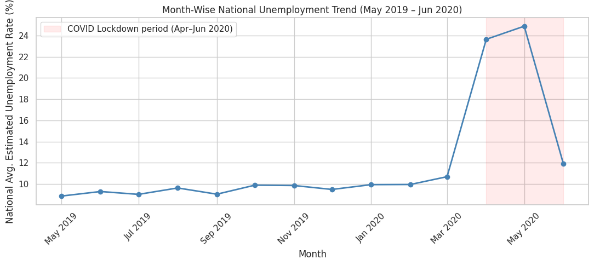
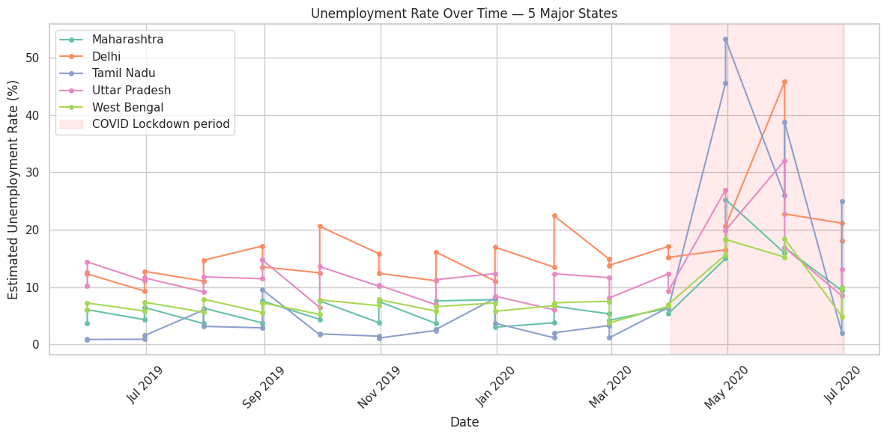
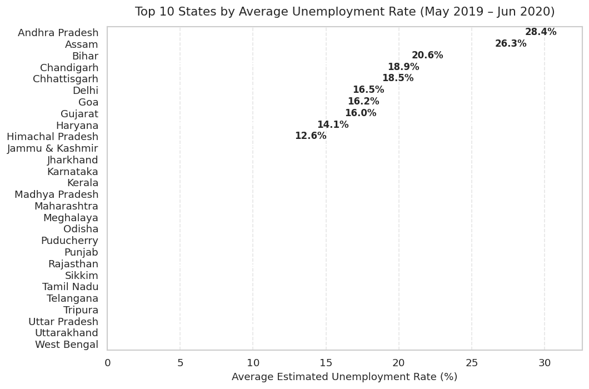
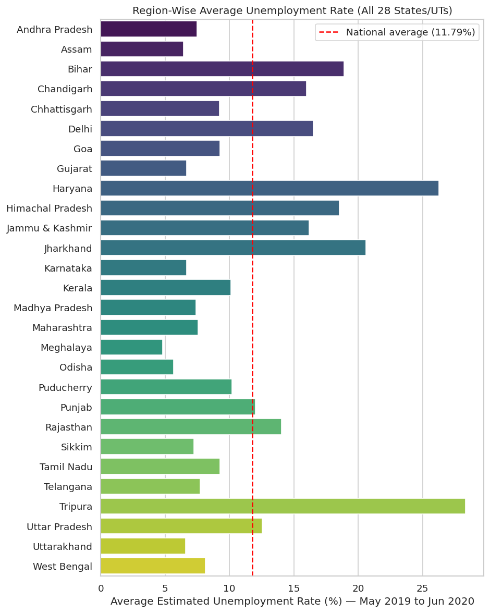
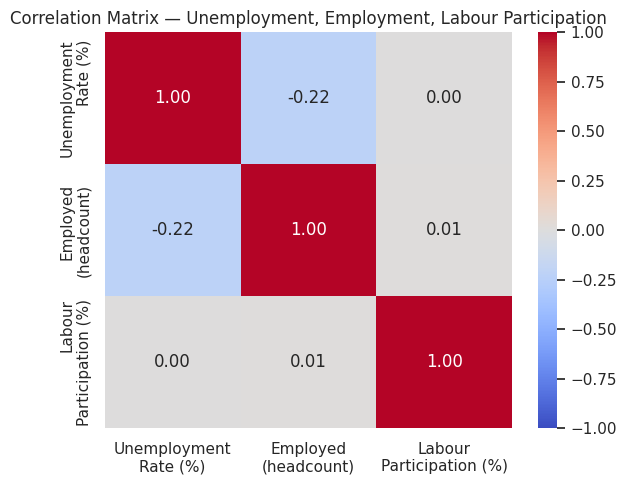
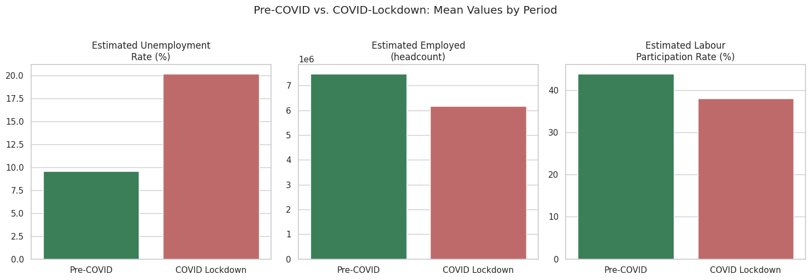
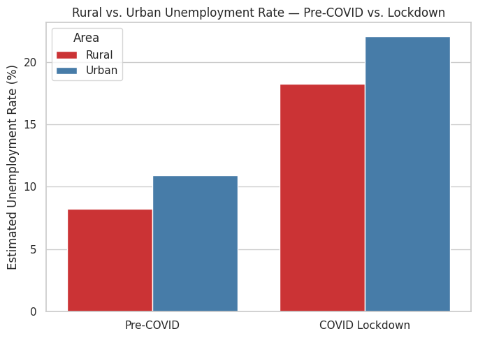
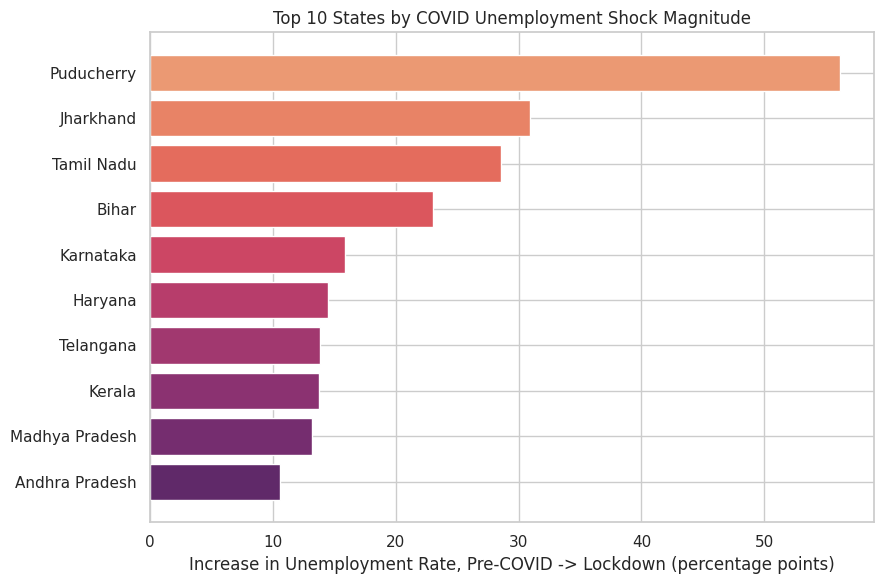

# Task 2 — Unemployment Analysis in India (Regional & COVID-19 Impact)

<div align="center">

[](https://oasisinfobyte.com/)
[](https://oasisinfobyte.com/)
[](#-oasis-infobyte-task-checklist-compliance)
[](#-statistical-hypothesis-testing-results)

**Program:** Oasis Infobyte Summer Internship Program (SIP) — Data Science Track  
**Author:** **Youssef Laaroussi** (Master's in Data Science & Artificial Intelligence)  
**Deliverable:** `Unemployment_Analysis_India.ipynb` (Google Colab & Jupyter Ready, Pre-executed)

</div>

---

## 📌 Executive Summary & Objective

Explore and quantify India's state-level unemployment dynamics to uncover regional disparities, temporal trends, and structural shifts. The core analytical focus is to **statistically validate and measure** the macroeconomic shock triggered by the COVID-19 nationwide lockdown (April–June 2020) across states, urban versus rural labor markets, and macroeconomic participation indicators.

---

## ✅ Oasis Infobyte Task Checklist Compliance

| # | Oasis Infobyte Feature Requirement | Status | Implementation Details & Section Reference |
| :-: | :--- | :---: | :--- |
| 1 | **Download a suitable dataset** | `[x]` Done | Sourced authentic "Unemployment in India" dataset (740 records, 28 States/UTs) (Section 2) |
| 2 | **Data loading, shape inspection & null check** | `[x]` Done | Shape verification (768 raw rows), null check, dropped empty padding rows (Section 3.1–3.2) |
| 3 | **Data type conversion & cleaning** | `[x]` Done | Stripped stray whitespace from column names/strings, parsed dates to datetime (Section 3.3) |
| 4 | **EDA: Region-wise average rates** | `[x]` Done | Computed and ranked average unemployment across all 28 states/UTs (Section 4) |
| 5 | **EDA: Month-wise national trends** | `[x]` Done | Aggregated monthly national time-series identifying the April 2020 structural break (Section 5) |
| 6 | **Time-series line chart for major states** | `[x]` Done | Temporal evolution for 5 major states (Maharashtra, Delhi, Tamil Nadu, UP, West Bengal) (Section 6) |
| 7 | **Bar chart: Top 10 states by unemployment** | `[x]` Done | Horizontal bar chart of top 10 highest-unemployment states with direct percentage labels (Section 7) |
| 8 | **Heatmap: Correlation between indicators** | `[x]` Done | Evaluated correlation between Unemployment Rate, Employed headcount, and Labour Participation (Section 8) |
| 9 | **Pre-COVID vs. Post-COVID comparison** | `[x]` Done | Empirically derived cutoff (Mar 2020), compared means/medians, and validated with Mann-Whitney U test (Section 9) |
| 10 | **Written observations between charts** | `[x]` Done | Markdown cells after every visualization detailing economic insights and policy implications (Section 4–11) |
| 11 | **Clean, well-commented Notebook** | `[x]` Done | Pre-executed Jupyter notebook with clean typography, robust Matplotlib rendering, and zero errors |

---

## 🔬 Skills & Methodological Rigor

- **Evidence-based cutoff derivation:** Pre- and lockdown periods were determined by empirically inspecting the national monthly inflection point (March 2020) rather than assuming arbitrary calendar splits.
- **Non-parametric inferential statistics:** Conducted a two-sided Mann-Whitney U test demonstrating that the lockdown unemployment surge from 9.61% to 20.19% is statistically significant ($p = 8.79 \times 10^{-17}$).
- **Defensive data cleaning:** Handled leading whitespace in datetime strings (`" 31-05-2019"`) and dropped blank padding rows that silently distort summary aggregations.
- **Plotting architecture fix:** Avoided categorical seaborn hue artifacts by rendering directly through Matplotlib horizontal bars with explicit string labels.
- **Sectoral sensitivity & shock magnitude:** Dissected the labor shock across Rural vs. Urban strata and computed state-by-state percentage-point deltas, revealing that **Puducherry suffered the highest acute shock (+56.1 percentage points)**.

---

## 📊 Visual Insights & Key Findings

### 1. National Monthly Unemployment Trend (The COVID Structural Break)
National unemployment held steady in the **~9–10% band** from May 2019 to March 2020, then spiked abruptly to **23.6% in April 2020** and peaked at **24.9% in May 2020** during the nationwide lockdown.



### 2. Multi-State Temporal Trajectories
Individual states experienced divergent trajectories during the lockdown period; highly urbanized and industrial territories suffered abrupt, extreme volatility.



### 3. Top 10 States by Overall Average Unemployment Rate
Tripura (28.4%) and Haryana (26.3%) registered the highest baseline unemployment over the entire observation period, driven by persistent structural labor market imbalances.



### 4. Full Geographic Distribution Across All 28 States & Union Territories
Complete regional view of all 28 states and union territories compared against the national benchmark average (11.79%).



### 5. Correlation Between Macroeconomic Indicators
Correlation matrix confirms that Unemployment Rate exhibits an inverse relationship with Employed headcount ($r = -0.22$) and near-zero linear correlation with Labour Participation Rate ($r \approx 0.00$).



### 6. Pre-COVID vs. Lockdown Aggregate Metrics
Mean unemployment surged from **9.61% pre-COVID to 20.19% during lockdown** (+10.58 percentage points), accompanied by contractions in total employed headcount and labour participation.



### 7. Rural vs. Urban Asymmetric Vulnerability
Urban unemployment experienced a sharper surge during lockdown, reflecting the vulnerability of service, retail, and manufacturing sectors under strict mobility restrictions.



### 8. State-Level COVID Shock Magnitude (Percentage Point Increase)
Decoupling chronic unemployment from acute shock sensitivity: **Puducherry (+56.1 pp)**, **Jharkhand (+31.0 pp)**, and **Tamil Nadu (+28.6 pp)** absorbed the most catastrophic pandemic disruptions.



---

## 📈 Statistical Hypothesis Testing Results

| Metric / Cohort | Pre-COVID (May 2019 – Mar 2020) | COVID Lockdown (Apr 2020 – Jun 2020) | Test Statistic & P-Value | Statistical Conclusion |
| :--- | :---: | :---: | :---: | :--- |
| **Sample Size ($N$)** | 588 records | 152 records | — | Complete regional representation |
| **Mean Unemployment Rate** | **9.61%** | **20.19%** | $+10.58\text{ pp}$ | Mean rate more than doubled |
| **Median Unemployment Rate** | **7.22%** | **16.40%** | $+9.18\text{ pp}$ | Robust against extreme outliers |
| **Mann-Whitney U Test** | — | — | **$U = 25141.5$**<br>**$p = 8.79 \times 10^{-17}$** | **Statistically Significant ($p \ll 0.001$)** |

---

## 📁 Repository Structure

```text
DataScience-Task2-UnemploymentAnalysis/
├── Unemployment_Analysis_India.ipynb   # Full interactive notebook with all executed outputs
├── Unemployment in India.csv           # Cleaned source dataset (740 records)
├── README.md                           # Comprehensive macroeconomic analysis report
└── assets/                             # High-resolution generated plots
    ├── national_monthly_trend.png
    ├── major_states_trend.png
    ├── top10_unemployment_states.png
    ├── region_wise_all_states.png
    ├── indicators_correlation_heatmap.png
    ├── precovid_vs_lockdown_metrics.png
    ├── rural_vs_urban_breakdown.png
    └── top_covid_shock_magnitude.png
```

---

## 🚀 How to Run

1. Ensure `Unemployment in India.csv` is located in this directory.
2. Launch with Jupyter Notebook:
   ```bash
   jupyter notebook Unemployment_Analysis_India.ipynb
   ```
