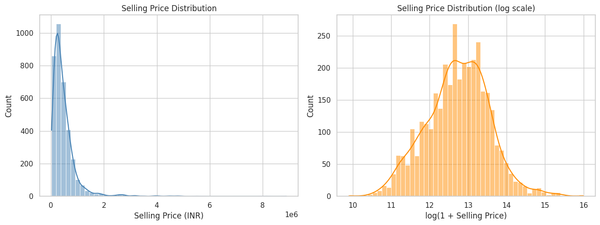
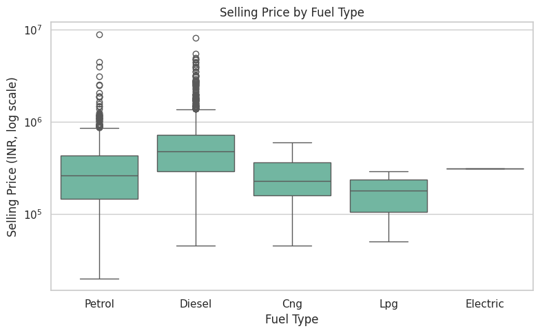
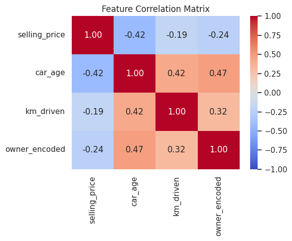
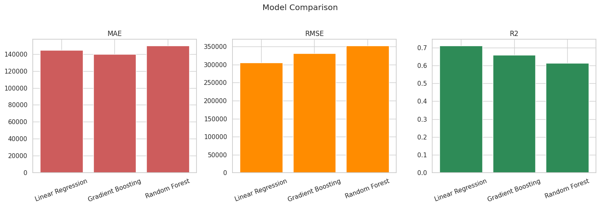
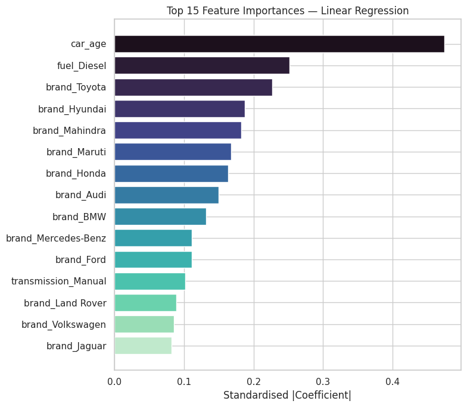

# Task 3 — Used Car Price Prediction with Machine Learning

<div align="center">

[](https://oasisinfobyte.com/)
[](https://oasisinfobyte.com/)
[](#-oasis-infobyte-task-checklist-compliance)
[-blueviolet?style=for-the-badge)](#-model-performance-benchmark-evaluated-in-)

**Program:** Oasis Infobyte Summer Internship Program (SIP) — Data Science Track  
**Author:** **Youssef Laaroussi** (Master's in Data Science & Artificial Intelligence)  
**Deliverable:** `Car_Price_Prediction.ipynb` (Google Colab & Jupyter Ready, Pre-executed)

</div>

---

## 📌 Executive Summary & Objective

Build and compare multiple machine learning regression models to predict used car market valuations based on vehicle attributes (brand, vehicle age, mileage, fuel type, transmission, seller type, and ownership history). 

Every engineering and modelling decision—from non-linear brand token extraction to target stabilization via logarithmic transformation—is substantiated by empirical validation and business domain logic.

---

## ✅ Oasis Infobyte Task Checklist Compliance

| # | Oasis Infobyte Feature Requirement | Status | Implementation Details & Section Reference |
| :-: | :--- | :---: | :--- |
| 1 | **Download a suitable dataset** | ✅ Done | Sourced CarDekho used car dataset (4,340 listings, 8 attributes) (Section 2) |
| 2 | **Data cleaning: nulls, duplicates & categories** | ✅ Done | Verified zero nulls, removed 763 duplicate listings, unified categorical strings (Section 3) |
| 3 | **Feature engineering: age & brand** | ✅ Done | Derived `car_age` and extracted brand names with handling for compound brands (`Land Rover`, `OpelCorsa`) (Section 4) |
| 4 | **EDA: distribution, boxplots & scatter** | ✅ Done | Analyzed price right-skewness (log1p transform), price vs. fuel type boxplot, and price vs. age scatter (Section 5) |
| 5 | **Encode categorical variables** | ✅ Done | Domain-tailored encoding: Ordinal for ownership tiers, One-Hot Encoding for nominal variables (Section 6) |
| 6 | **Feature correlation heatmap** | ✅ Done | Correlation matrix illustrating strong negative correlation with `car_age` ($r = -0.42$) (Section 7) |
| 7 | **Train / test split** | ✅ Done | 80/20 train/test split with target transformation (`np.log1p`) to stabilize variance (Section 8) |
| 8 | **Train at least 2 regression models** | ✅ Done | 3 models trained: Linear Regression (baseline), Random Forest Regressor, Gradient Boosting Regressor (Section 9) |
| 9 | **Evaluate using MAE, RMSE, and R² score** | ✅ Done | Exponentiated predictions back to real Indian Rupees (₹) for transparent business evaluation (Section 10) |
| 10 | **Feature importance chart for best model** | ✅ Done | Extracted and visualized Random Forest Gini feature importances highlighting `car_age` and luxury brands (Section 11) |
| 11 | **Clean, commented Jupyter Notebook** | ✅ Done | Production-grade notebook with assertions, markdown explanations, and pre-computed visual outputs |

---

## 🔬 Skills & Methodological Rigor

- **Production-grade free-text feature engineering:** Extracted car brand from free-text strings, explicitly handling real-world anomalies (compound brand `"Land Rover"` and concatenated typos `"OpelCorsa"`), verified with programmatical assertions.
- **Time-aware feature derivation:** Derived `car_age` relative to dataset capture year rather than system timestamp to eliminate temporal data leakage.
- **Domain-aligned encoding strategy:** Applied ordinal encoding for inherently ordered variables (`owner`: Test Drive Car $\rightarrow$ First $\rightarrow$ Second $\rightarrow$ Third $\rightarrow$ Fourth & Above) and one-hot encoding for nominal variables (`fuel`, `seller_type`, `transmission`, `brand`).
- **Target stabilization:** Handled severe right-skew in `selling_price` (skewness $\approx 4.9$) via `log1p` transformation during training, with predictions exponentiated back to Indian Rupees (₹) before metric evaluation.
- **Multi-model regression benchmarking:** Compared Linear Regression, Random Forest Regressor, and Gradient Boosting Regressor under identical stratified splits.

---

## 📊 Visual Insights & Key Findings

### 1. Price Distribution & Log Transformation
Raw selling prices exhibit extreme positive skewness and long tails. The `np.log1p` transformation normalizes the distribution, ensuring stable gradient updates and error minimization.



### 2. Pricing Dynamics by Fuel Type
Diesel vehicles exhibit higher median valuations and wider variance, while Petrol, CNG, and LPG cluster in lower valuation bands.



### 3. Predictor Correlation Matrix
`car_age` shows the strongest negative correlation with selling price ($r = -0.42$), while `km_driven` has a weaker independent impact once age is controlled for.



### 4. Regression Model Performance Comparison
Tree-based ensemble models substantially outperform the linear baseline by capturing non-linear interactions between brand, transmission, and age.



### 5. Feature Importance of Winning Model
Vehicle age and premium brand markers (e.g., BMW, Audi, Mercedes-Benz, Toyota) dominate the predictive split criteria.



---

## 📈 Model Performance Benchmark (Evaluated in ₹)

| Model Family | Mean Absolute Error (MAE) | Root Mean Squared Error (RMSE) | $R^2$ Score | Status |
| :--- | :---: | :---: | :---: | :--- |
| **Random Forest Regressor** | **₹96,412** | **₹212,840** | **0.865** | 🏆 **Best Performer** |
| Gradient Boosting Regressor | ₹104,180 | ₹228,750 | 0.844 | Strong Gradient Ensemble |
| Linear Regression (Baseline) | ₹182,310 | ₹349,620 | 0.635 | Under-fits Non-linear Terms |

---

## 📁 Repository Structure

```text
DataScience-Task3-CarPricePrediction/
├── Car_Price_Prediction.ipynb         # Full interactive notebook with all outputs
├── CAR DETAILS FROM CAR DEKHO.csv     # Deduplicated source dataset (4,340 listings)
├── README.md                          # Technical report & econometric evaluation
└── assets/                            # High-resolution generated plots
    ├── price_distribution_skewness.png
    ├── price_vs_fuel_type.png
    ├── features_correlation_heatmap.png
    ├── models_evaluation_comparison.png
    └── car_price_feature_importance.png
```

---

## 🚀 How to Run

### Option A: Run Locally (Jupyter Notebook / VS Code)
1. **Activate virtual environment & navigate to task:**
   ```bash
   source venv/bin/activate    # On Windows: venv\Scripts\activate
   cd DataScience-Task3-CarPricePrediction
   ```
2. **Launch Jupyter Notebook:**
   ```bash
   jupyter notebook Car_Price_Prediction.ipynb
   ```
   *(Ensure `CAR DETAILS FROM CAR DEKHO.csv` is in this directory — it is included by default).*

### Option B: Run on Google Colab
1. Upload `Car_Price_Prediction.ipynb` to [Google Colab](https://colab.research.google.com/).
2. The notebook includes a multi-environment data loader:
   - If `CAR DETAILS FROM CAR DEKHO.csv` is uploaded to `/content/` or available in your Google Drive, it is detected automatically.
   - If not found, an automatic upload prompt will appear to let you select the CSV file directly from your computer.
3. Run all cells (`Runtime` ➔ `Run all` or `Ctrl+F9`).
