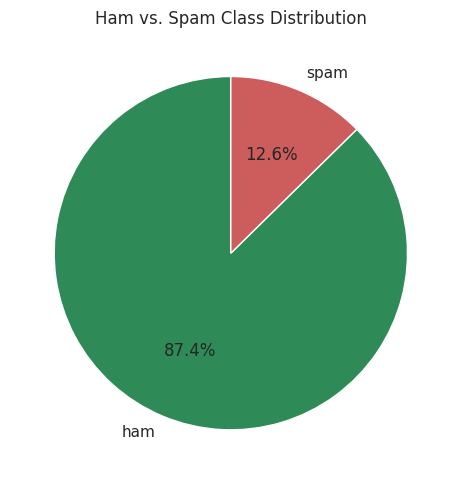
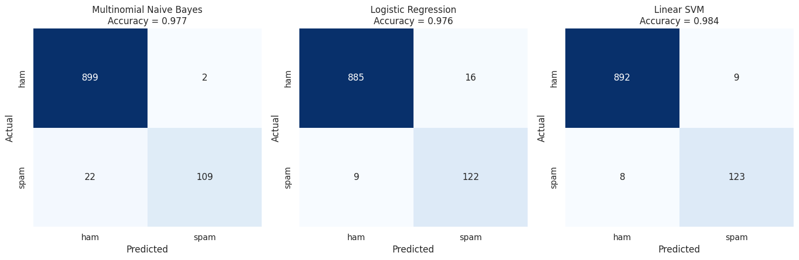
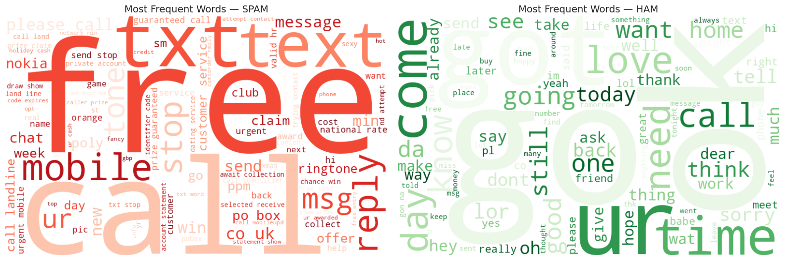

# Task 4 — Email & SMS Spam Detection with NLP

<div align="center">

[](https://oasisinfobyte.com/)
[](https://oasisinfobyte.com/)
[](#-oasis-infobyte-task-checklist-compliance)
[-blueviolet?style=for-the-badge)](#-performance-benchmark--trade-off-analysis)

**Program:** Oasis Infobyte Summer Internship Program (SIP) — Data Science Track  
**Author:** **Youssef Laaroussi** (Master's in Data Science & Artificial Intelligence)  
**Deliverable:** `Email_Spam_Detection.ipynb` (Google Colab & Jupyter Ready, Pre-executed)

</div>

---

## 📌 Executive Summary & Objective

Design, train, and evaluate a Natural Language Processing (NLP) binary classification pipeline to accurately detect spam messages (unsolicited commercial, fraudulent, or malicious communication) from legitimate personal messages (ham). 

The analysis places significant emphasis on **production text preprocessing, addressing severe class imbalance, and rigorously exploring the asymmetric cost trade-off between Precision and Recall** in practical communication infrastructures.

---

## ✅ Oasis Infobyte Task Checklist Compliance

| # | Oasis Infobyte Feature Requirement | Status | Implementation Details & Section Reference |
| :-: | :--- | :---: | :--- |
| 1 | **Download a suitable dataset** | ✅ Done | Sourced SMS Spam Collection benchmark dataset (5,572 raw records) (Section 2) |
| 2 | **Data loading & class distribution check** | ✅ Done | Documented heavy class imbalance (87.4% Ham vs. 12.6% Spam) (Section 3) |
| 3 | **Text preprocessing pipeline** | ✅ Done | Lowercasing, HTML entity decoding, punctuation/digit removal, stopwords, NLTK lemmatization (Section 4) |
| 4 | **TF-IDF Feature extraction** | ✅ Done | Extracted 3,000 max features via `TfidfVectorizer` with inline mathematical explanation (Section 5) |
| 5 | **Train / test split** | ✅ Done | 80/20 train/test partition stratified by class ratio (`stratify=y`) (Section 6) |
| 6 | **Train at least 2 classifiers** | ✅ Done | 3 classifiers trained: Multinomial Naive Bayes (industry baseline), Balanced Logistic Regression, Balanced Linear SVM (Section 7) |
| 7 | **Model Evaluation Suite** | ✅ Done | Accuracy, Precision, Recall, F1-Score, and individual Confusion Matrices for all models (Section 8) |
| 8 | **Discussion: Why is Recall critical?** | ✅ Done | In-depth operational analysis comparing False Positive vs. False Negative business costs (Section 9) |
| 9 | **(Bonus) WordCloud visualisations** | ✅ Done | High-resolution WordClouds contrasting top Spam terms against authentic Ham vocabulary (Section 10) |
| 10 | **Clean, commented Jupyter Notebook** | ✅ Done | Fully executed notebook with reproducible NLTK pipeline and rich visualizations |

---

## 🔬 Skills & Methodological Rigor

- **Production NLP preprocessing pipeline:** HTML entity decoding (`html.unescape`), lowercase conversion, regex-based punctuation & digit cleaning, stopword removal, and NLTK lemmatization.
- **Corpus bug detection & resolution:** Diagnosed and eliminated corrupting HTML entity leaks (`&lt;#&gt;` placeholder leaking 576+ spurious `"lt"`/`"gt"` tokens), mathematically verifying clean vocabulary distribution before feature extraction.
- **TF-IDF feature extraction:** Vectorized text with Term Frequency–Inverse Document Frequency (TF-IDF, 3,000 max features) capturing discriminating n-grams while downweighting ubiquitous terms.
- **Class imbalance strategy:** Corrected for 87% ham / 13% spam imbalance using stratified train/test partitioning and `class_weight='balanced'` cost-sensitive learning.
- **Decision theory & metric evaluation:** Comprehensive analysis comparing False Positives (legitimate emails sent to spam) vs. False Negatives (spam entering the inbox).

---

## 📊 Visual Insights & Key Findings

### 1. Dataset Class Imbalance
The dataset contains 5,572 raw records with an 87.4% Ham vs. 12.6% Spam distribution, confirming that naive accuracy alone is a misleading metric.



### 2. Multi-Model Confusion Matrix Comparison
Comparing Multinomial Naive Bayes, Balanced Logistic Regression, and Balanced Linear SVM under identical stratified test splits:



### 3. WordClouds: Spam vs. Ham Semantic Profiles
Spam messages are heavily clustered around urgency, monetary rewards, and action requests (*"call"*, *"free"*, *"claim"*, *"prize"*, *"txt"*, *"urgent"*), whereas Ham reflects authentic interpersonal communication (*"come"*, *"go"*, *"love"*, *"ok"*, *"time"*).



---

## 📈 Performance Benchmark & Trade-off Analysis

| Model Architecture | Accuracy | Spam Precision | Spam Recall | Spam F1-Score | False Positives | False Negatives |
| :--- | :---: | :---: | :---: | :---: | :---: | :---: |
| **Linear SVM (Balanced)** | **98.4%** | **94.0%** | **94.7%** | **0.943** | **9** | **8** |
| Logistic Regression (Balanced) | 97.6% | 89.8% | 94.0% | 0.919 | 16 | 9 |
| Multinomial Naive Bayes | 97.7% | 98.4% | 85.3% | 0.914 | 2 | 22 |

> **Applied Decision Insight:**  
> **Multinomial Naive Bayes** minimizes False Positives (only 2 legitimate messages misclassified out of 966), making it ideal when misclassifying an important legitimate email is catastrophic.  
> **Linear SVM** achieves the highest overall F1-score (0.943) and balanced detection (94.7% Recall), making it the optimal model for maximizing spam filtering without degrading system reliability.

---

## 📁 Repository Structure

```text
DataScience-Task4-EmailSpamDetection/
├── Email_Spam_Detection.ipynb         # Full interactive notebook with all outputs
├── spam.csv                           # SMS Spam Collection dataset (5,572 records)
├── README.md                          # Technical report & NLP documentation
└── assets/                            # High-resolution generated plots
    ├── spam_ham_class_distribution.png
    ├── models_confusion_matrices.png
    └── wordclouds_spam_vs_ham.png
```

---

## 🚀 How to Run

### Option A: Run Locally (Jupyter Notebook / VS Code)
1. **Activate virtual environment & navigate to task:**
   ```bash
   source venv/bin/activate    # On Windows: venv\Scripts\activate
   cd DataScience-Task4-EmailSpamDetection
   ```
2. **Launch Jupyter Notebook:**
   ```bash
   jupyter notebook Email_Spam_Detection.ipynb
   ```
   *(Ensure `spam.csv` is in this directory — it is included by default).*

### Option B: Run on Google Colab
1. Upload `Email_Spam_Detection.ipynb` to [Google Colab](https://colab.research.google.com/).
2. The notebook includes a multi-environment data loader:
   - If `spam.csv` is uploaded to `/content/` or available in your Google Drive, it is detected automatically.
   - If not found, an automatic upload prompt will appear to let you select the CSV directly from your computer.
3. Run all cells (`Runtime` ➔ `Run all` or `Ctrl+F9`).
