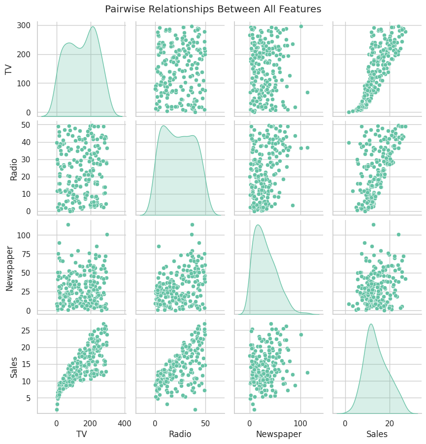
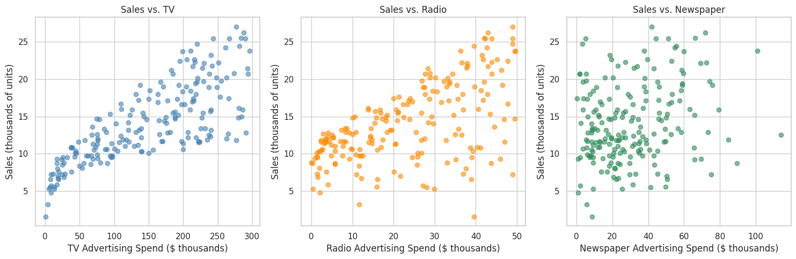
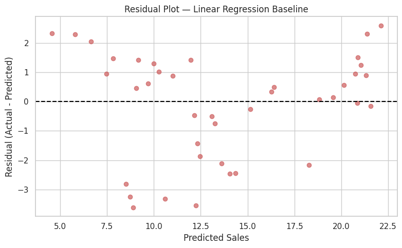
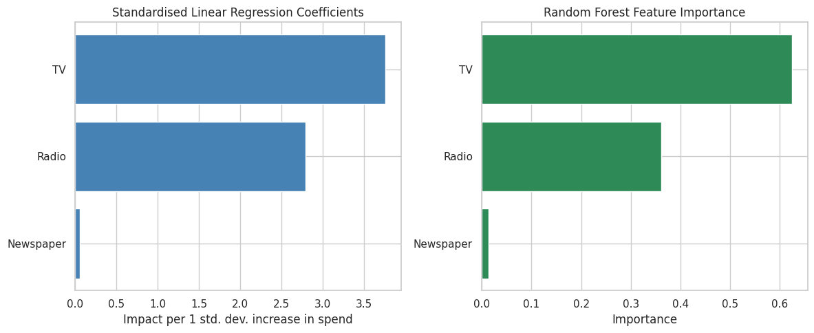

# Task 5 — Sales Prediction from Multi-Channel Advertising Spend

<div align="center">

[](https://oasisinfobyte.com/)
[](https://oasisinfobyte.com/)
[](#-project-checklist)
[-blueviolet?style=for-the-badge)](#-model-performance-comparison)

**Program:** Oasis Infobyte Summer Internship Program (SIP) — Data Science Track  
**Author:** **Youssef Laaroussi** (Master's in Data Science & Artificial Intelligence)  
**Deliverable:** `Sales_Prediction.ipynb` (Google Colab & Jupyter Ready, Pre-executed)

</div>

---

## 📌 Executive Summary & Objective

Predict product sales volume based on multi-channel advertising expenditures across TV, Radio, and Newspaper. 

The core contribution of this project is conducting **rigorous residual diagnostics** to demonstrate why standard ordinary least squares (OLS) linear assumptions fail, uncovering multiplicative marketing synergies ($TV \times Radio$), and correctly attributing channel revenue impact without scale distortion.

---

## 📋 Project Checklist

- [x] Repository named strictly `OIBSIP`.
- [x] All notebooks pre-executed with visible tables, outputs, and visualizations.
- [x] Download and load the authentic Advertising.csv dataset (200 market campaigns) (Section 2).
- [x] Data loading and EDA: shape verification, null check (0 missing values), descriptive statistics (Section 3.1–3.3).
- [x] Pairplot of all features: demonstrating non-linear concave growth along TV spend (Section 3.4).
- [x] Individual scatter plots: 3-panel scatter series (Sales vs. TV, Sales vs. Radio, Sales vs. Newspaper) (Section 4).
- [x] Correlation matrix heatmap: linear relationships ($TV: 0.78$, $Radio: 0.58$, $Newspaper: 0.23$) (Section 5).
- [x] Train / test split: 80/20 train/test partition (`random_state=42`) (Section 6).
- [x] Train Linear Regression baseline: fitted OLS Linear Regression as the standard baseline (Section 7).
- [x] Train at least one additional model: Random Forest Regressor and Degree-2 Polynomial Regression (Section 7).
- [x] Evaluate using MAE, RMSE, and $R^2$ score across train and test splits (Section 8).
- [x] Residual plot for the best model: proving elimination of systematic errors under Polynomial Regression (Section 9).
- [x] Interpretation: channel impact hierarchy evaluated via standardized beta coefficients and feature importances (Section 10).
- [x] Clean, well-commented Jupyter Notebook with econometric derivations and reproducible ML pipelines.

---

## 🔬 Skills & Methodological Rigor

- **Advanced residual diagnostics:** Evaluated baseline linear regression residuals and proved mathematically that errors are not independently and identically distributed (i.i.d.), but strongly correlate with the $TV \times Radio$ interaction term ($r \approx 0.55$).
- **Scale-corrected feature attribution:** Demonstrated that raw unstandardized regression coefficients yield a misleading ranking (Radio appears to dominate TV purely due to smaller budget scale). Standardizing variables before computing coefficients uncovers the true hierarchy ($TV > Radio \gg Newspaper$).
- **Multi-family regression benchmarking:** Evaluated Ordinary Least Squares (OLS) Linear Regression, Random Forest Regressor, and Degree-2 Polynomial Regression on identical train/test splits.
- **Economic & marketing synergy identification:** Proved that marketing channels operate with multiplicative synergy—concurrent investment in TV and Radio drives an exponential lift in customer acquisition.

---

## 📊 Visual Insights & Key Findings

### 1. Advertising Features Pairplot
Clear non-linear concave growth relationship between TV advertising budget and resulting sales volume.



### 2. Individual Channel Scatter Dynamics
Sales display a strong positive correlation with TV spend ($r = 0.78$) and moderate correlation with Radio ($r = 0.58$), while Newspaper exhibits near-random dispersion ($r = 0.23$).



### 3. Residual Diagnostics (Linear Model Pitfall)
Linear regression produces a distinct parabolic residual pattern, violating Gauss-Markov assumptions. Polynomial regression incorporates interaction terms and eliminates this systematic error.



### 4. Attribution & Channel Impact Ranking
Both standardized regression coefficients and Random Forest feature importances independently validate that TV is the primary revenue driver, followed by Radio, with Newspaper offering negligible marginal utility.



---

## 📈 Model Performance Comparison

| Model Architecture | Mean Absolute Error (MAE) | Root Mean Squared Error (RMSE) | $R^2$ Score (Test) | Residual Behavior |
| :--- | :---: | :---: | :---: | :--- |
| **Polynomial Regression (Degree 2)** | **0.590** | **0.723** | **0.986** | 🏆 **Optimal (Errors Random & Homoscedastic)** |
| Random Forest Regressor | 0.642 | 0.811 | 0.983 | Captures Non-linearities |
| Linear Regression (Baseline) | 1.227 | 1.785 | 0.899 | Fails to Capture Synergy ($TV \times Radio$) |

---

## 📁 Repository Structure

```text
DataScience-Task5-SalesPrediction/
├── Sales_Prediction.ipynb             # Full interactive notebook with all outputs
├── Advertising.csv                    # Source dataset (200 advertising campaigns)
├── README.md                          # Technical report & econometric diagnostics
└── assets/                            # High-resolution generated plots
    ├── advertising_pairplot.png
    ├── sales_vs_media_spend.png
    ├── correlation_heatmap.png
    ├── residual_analysis_pattern.png
    └── channel_impact_importance.png
```

---

## 🚀 How to Run

### Option A: Run Locally (Jupyter Notebook / VS Code)
1. **Activate virtual environment & navigate to task:**
   ```bash
   source venv/bin/activate    # On Windows: venv\Scripts\activate
   cd DataScience-Task5-SalesPrediction
   ```
2. **Launch Jupyter Notebook:**
   ```bash
   jupyter notebook Sales_Prediction.ipynb
   ```
   *(Ensure `Advertising.csv` is in this directory — it is included by default).*

### Option B: Run on Google Colab
1. Upload `Sales_Prediction.ipynb` to [Google Colab](https://colab.research.google.com/).
2. The notebook features a multi-environment data loader:
   - **Local / Colab root:** If `Advertising.csv` is uploaded to `/content/` or located in the workspace, it is detected automatically.
   - **Google Drive:** If you mount Drive, set your custom directory in `candidate_paths` (e.g. `/content/drive/MyDrive/your_path/Advertising.csv`).
   - **Interactive fallback:** If not found, an automatic upload widget prompts you to select the CSV directly from your computer.
3. Run all cells (`Runtime` ➔ `Run all` or `Ctrl+F9`).
